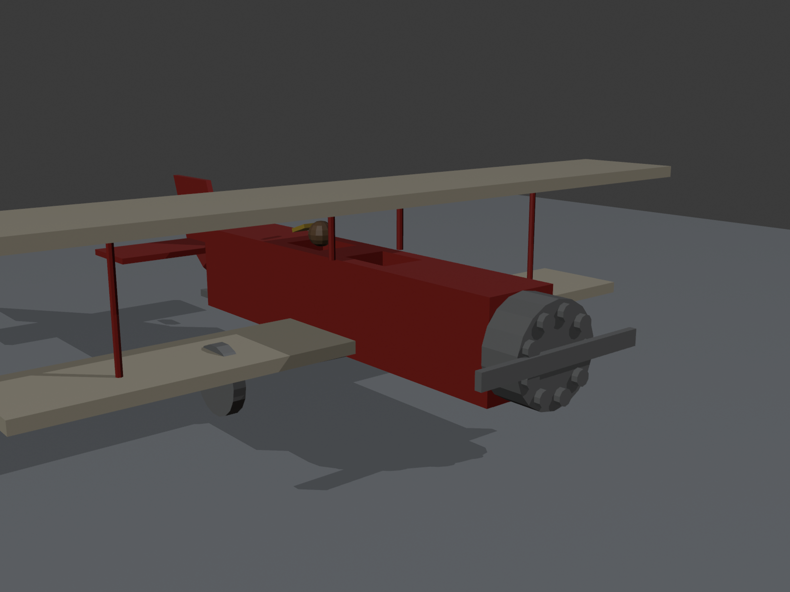

<div align="center">

# ✈️ Hangar 01 — Nu.D36 Biplane

**BMU1421 · Dijital Oyun Tasarımı** — 2026-2027 Güz · Hafta 01

*Blender'da 1930'lardan bir çift kanatlı eğitim uçağını (Nu.D36'dan esinlenerek)*
*gerçek ölçekte modelleyip Unity'de pervanesini döndürme ödevi.*

[](https://davut.tech/courses/2026-2027/fall/BMU1421)
[](https://www.blender.org/)
[](https://unity.com/)

</div>

<p align="center">
  
</p>

---

## 📖 Özet

Uçağın **tamamı Blender Python API'siyle koddan üretildi** — elle poligon poligon
modelleme yerine, gerçek ölçülere (6.4 m gövde, 9.74 m üst kanat açıklığı, ~2.44 m
yükseklik) sadık, tekrarlanabilir bir üretici script (`Blender/generate_nu_d36.py`)
yazıldı. Script gövdeyi, çift kanadı (stagger'lı, V dikmeli), kuyruğu (eğimli dümen),
iniş takımını (V biçimli dikmeler), motoru ve pervaneyi oluşturur, renklendirir,
pervane hariç her şeyi `Nu_D36` adıyla birleştirir, orijini tekerlek/zemin
seviyesine çeker ve Unity için doğru ayarlarla FBX'e aktarır. Unity tarafında
pervane sürekli döner, uçak sahnede hareket eder ve kamera onu takip eder.

## 🎥 Ekran Kaydı

Pervanenin dönüşü ve uçağın hareketi:

<video src="Kayit/ekran_kaydi.mp4" width="720" controls></video>

*(Video bu sayfada oynatılmıyorsa [doğrudan buradan indirip izleyebilirsin](Kayit/ekran_kaydi.mp4).)*

## 🌐 Tarayıcıda Görüntüle (three.js)

`ThreeJS/viewer.html` — three.js (module CDN, GLTFLoader + OrbitControls) ile yazılmış
bağımsız bir görüntüleyici; `Nu_D36.glb`'yi yükleyip fareyle serbestçe döndürüp
yakınlaştırmanı sağlar. Çalıştırmak için:

```bash
cd ThreeJS
python3 -m http.server 8000
# tarayıcıda: http://localhost:8000/viewer.html
```

## 📁 İçerik

| Dosya | Açıklama |
|---|---|
| `Assets/Models/Nu_D36.fbx` | Blender'da üretilen, Unity'ye aktarılan uçak modeli |
| `Assets/Scripts/PervaneDondur.cs` | Pervaneyi sürekli döndüren betik (`Pervane` nesnesine bağlı) |
| `Assets/Scripts/UcagiIlerlet.cs` | Uçağı otomatik ileri hareket ettiren + ok tuşlarıyla ekstra kontrol sağlayan bonus betik |
| `Assets/Materials/` | Gövde (kırmızı), kanat (krem), motor/pervane (gri), pilot (deri), atkı (sarı) malzemeleri |
| `Assets/Scenes/SampleScene.unity` | Modelin, zeminin, karşılaştırma küpünün ve takip kamerasının bulunduğu sahne |
| `Blender/Nu_D36.blend` | Orijinal Blender kaynak dosyası |
| `Blender/generate_nu_d36.py` | Modeli sıfırdan üreten Blender Python betiği |
| `Blender/Nu_D36.glb` | Tarayıcı/three.js için glTF dışa aktarımı |
| `ThreeJS/viewer.html` | Bağımsız three.js model görüntüleyici (bonus) |
| `Kayit/ekran_kaydi.mp4` | Pervane + hareket ekran kaydı |
| `oyun_ekran_goruntusu.png` | Game görünümünden, pervane dönerken alınmış ekran görüntüsü |

## ✅ Bonus Görevler

| Görev | Durum |
|---|---|
| Pilot + rüzgârda uçuşan atkı (arka kokpit) | ✅ |
| Yıldız motor (motorun önünde 9 silindir) | ✅ |
| Uçağı ilerletme betiği (ok tuşu/WASD kontrollü) | ✅ |
| Takip kamerası (`Main Camera`, `Nu_D36`'nın child'ı) | ✅ |
| Tarayıcıda gösterme (three.js + glTF) | ✅ |
| Kısa ekran kaydı | ✅ |
| GitHub deposu | ✅ (bu depo) |

## 🚀 Nasıl Çalıştırılır

1. Unity Hub → **Unity 6.3 LTS (6000.3.25f1)** ile bu klasörü proje olarak aç.
2. `Assets/Scenes/SampleScene.unity` sahnesi otomatik açılır — zemin, karşılaştırma
   küpü (1 m) ve takip kamerası hazır durumda.
3. **Play**'e bas:
   - Pervane sürekli döner (`PervaneDondur.cs`)
   - Uçak otomatik olarak ileri gider; **↑/↓** (veya **W/S**) ile ileri/geri,
     **←/→** (veya **A/D**) ile dönüş kontrol edilebilir (`UcagiIlerlet.cs`)
   - Kamera uçağın child'ı olduğu için hareketi ve dönüşü otomatik takip eder

## 🛠️ Teknik Notlar

- **Modelleme:** `bpy` (Blender Python API) ile primitive tabanlı, düşük-poligonlu
  üretim — küp/silindir/koni ilkelleri, `to_track_quat` ile iki nokta arası dikme
  hizalama (V biçimli iniş takımı) ve `bmesh` ile üst-alt vertex kaydırma (eğimli dümen).
- **Origin / zemin hizası:** `Nu_D36`'nın origin'i gövde merkezinden **tekerlek/zemin
  seviyesine (dünya Z=0)** taşındı; aksi halde Unity'de Position (0,0,0) verildiğinde
  gövde-merkezli pivot yüzünden uçağın alt kısmı (tekerlek, pervane) zeminin altına
  gömülüyordu.
- **FBX dışa aktarım:** `axis_forward='-Z'`, `axis_up='Y'`, `apply_scale_options='FBX_SCALE_ALL'`,
  `bake_space_transform=True` — Blender → Unity ekseni dönüşümü için standart ayarlar.
- **Girdi sistemi:** Proje **yeni Input System**'i kullandığı için `UcagiIlerlet.cs`
  `UnityEngine.InputSystem.Keyboard.current` ile okuma yapar (eski `Input.GetAxis`
  bu projede sessizce çalışmaz).

---

<div align="center">

Dr. Öğr. Üyesi **Davut ARI** — [davut.tech/courses/2026-2027/fall/BMU1421](https://davut.tech/courses/2026-2027/fall/BMU1421)

</div>
